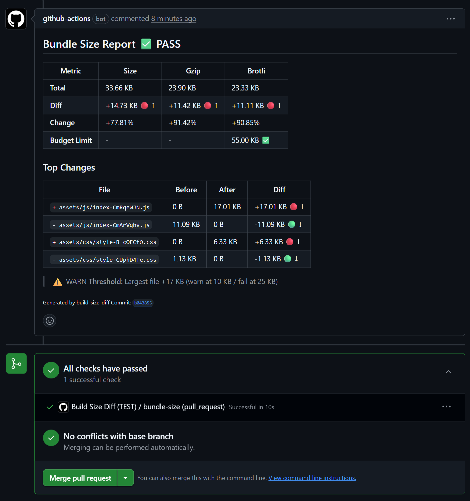

# Build Size Diff

**GitHub Action for automated bundle size tracking in CI/CD.** Catch performance regressions before merging with instant PR comments showing gzip/brotli metrics.

Works with any bundler: Vite, Webpack, Rollup, esbuild, Parcel, Turbopack, Rspack, Next.js, Nuxt, Astro, SvelteKit.



Real PR comment showing:

- Total bundle size (gzip/brotli)
- Per-file changes with clear +/- markers and arrows (🔴 ↑ / 🟢 ↓)
- Budget status (✅ / ⚠️ / ❌)
- Top file changes ranked by impact (⬆️ largest first)

---

## Quick Start

Add this workflow to `.github/workflows/bundle-size.yml`:

```yaml
name: Bundle Size

on: [push, pull_request]

permissions:
  contents: read
  pull-requests: write
  actions: write

jobs:
  size-check:
    runs-on: ubuntu-latest
    steps:
      - uses: actions/checkout@v4
      - uses: actions/setup-node@v4
      - uses: q1sh101/build-size-diff@v1
        with:
          github-token: ${{ secrets.GITHUB_TOKEN }}
```

**That's it.** Push to your default branch → creates baseline. Open PR → see size diff comment.

**Zero config** for Vite, Webpack, Next.js, Nuxt, Astro, Svelte. Custom build? Set `build-command` and `dist-path`.

---

## Features

- **PR-native feedback** - Size diff comments appear automatically in every PR
- **Multi-compression metrics** - Compare raw, gzip, and brotli sizes in one table
- **Budget enforcement** - Set limits and fail builds that exceed thresholds
- **Zero-config setup** - Auto-detects output folders for any bundler
- **Privacy-first** - Uses GitHub Artifacts only - no external services or data sharing
- **Framework-agnostic** - Scans JS/CSS output from any build tool

---

## How It Works

**On default branch push:**

1. Runs your build command
2. Scans output directory for `.js`/`.css` files (including `.mjs`/`.cjs`)
3. Calculates gzip/brotli sizes
4. Saves as baseline artifact (GitHub Artifacts API, default retention applies)

**On pull request:**

1. Runs build from PR code
2. Downloads baseline from PR base branch
3. Compares sizes file-by-file
4. Posts comment with visual diff table
5. Passes/fails based on budget thresholds

Baseline lookup checks recent workflow runs on the PR base branch, then falls back to repo-wide artifact search capped by `max-artifact-pages`. If no baseline is found, the action reports `no-baseline`.

**Performance:** Typical workflow overhead is a few seconds (build time excluded). Compression runs in parallel - handles massive projects effortlessly.

---

## Configuration

### Basic Example

```yaml
- uses: q1sh101/build-size-diff@v1
  with:
    github-token: ${{ secrets.GITHUB_TOKEN }}
    build-command: 'npm run build'
    dist-path: 'dist'
```

### Budget Enforcement

```yaml
- uses: q1sh101/build-size-diff@v1
  with:
    github-token: ${{ secrets.GITHUB_TOKEN }}
    budget-max-increase-kb: 55
    warn-above-kb: 10
    fail-above-kb: 25
```

### Monorepo Setup

```yaml
- uses: q1sh101/build-size-diff@v1
  with:
    github-token: ${{ secrets.GITHUB_TOKEN }}
    dist-path: 'apps/web/dist'
    build-command: 'npm run build --workspace=web'
```

### Custom Package Manager

```yaml
- uses: q1sh101/build-size-diff@v1
  with:
    github-token: ${{ secrets.GITHUB_TOKEN }}
    build-command: 'pnpm build'
```

If you use `pnpm`, ensure it's available on the runner (e.g., `corepack enable` or `pnpm/action-setup`) before running the action.

### Skip Install (Prebuilt Output)

If your build output already exists (e.g., `.next` is prebuilt), you can skip dependency installation and the build command:

```yaml
- uses: q1sh101/build-size-diff@v1
  with:
    github-token: ${{ secrets.GITHUB_TOKEN }}
    skip-install: true
    build-command: 'true'
```

### Conditional Comments

```yaml
- uses: q1sh101/build-size-diff@v1
  with:
    github-token: ${{ secrets.GITHUB_TOKEN }}
    comment-mode: 'on-increase' # Only comment when size increases
```

---

## All Options

| Input                    | Required | Default         | Description                                      |
| ------------------------ | -------- | --------------- | ------------------------------------------------ |
| `github-token`           | Yes      | -               | GitHub token for PR comments                     |
| `build-command`          | No       | `npm run build` | Your build command                               |
| `build-timeout-minutes`  | No       | `15`            | Max minutes to allow build to run before failing |
| `dist-path`              | No       | auto-detect     | Output directory                                 |
| `budget-max-increase-kb` | No       | -               | Max allowed increase (e.g., `10` or `0.5`)       |
| `warn-above-kb`          | No       | -               | Warn threshold per file                          |
| `fail-above-kb`          | No       | -               | Fail threshold per file                          |
| `comment-mode`           | No       | `always`        | `always` / `on-increase` / `never`               |
| `gzip`                   | No       | `true`          | Calculate gzip sizes (omit to keep default)      |
| `brotli`                 | No       | `true`          | Calculate brotli sizes (omit to keep default)    |
| `allow-unsafe-build`     | No       | `false`         | Allow shell commands or `pull_request_target`    |
| `fail-on-stderr`         | No       | `false`         | Fail build if stderr output is non-empty         |
| `fail-on-comment-error`  | No       | `false`         | Fail workflow if PR comment cannot be posted     |
| `skip-install`           | No       | `false`         | Skip dependency installation (use if prebuilt)   |
| `max-artifact-pages`     | No       | `10`            | Max artifact pages to search (100 per page)      |

**Comparison metric:** All budget and threshold checks use a single metric determined by:

- If `brotli: true` (default) → uses **brotli** sizes
- If `brotli: false` but `gzip: true` → uses **gzip** sizes
- If both `brotli: false` and `gzip: false` → uses **raw** sizes

This applies to `budget-max-increase-kb`, `warn-above-kb`, and `fail-above-kb`. To force raw size comparisons, set both compression options to `false`.

---

## Outputs

| Output         | Description                                          |
| -------------- | ---------------------------------------------------- |
| `total-size`   | Total bundle size (bytes)                            |
| `total-gzip`   | Total gzip size (bytes)                              |
| `total-brotli` | Total brotli size (bytes)                            |
| `diff-size`    | Size difference (bytes)                              |
| `diff-gzip`    | Gzip difference (bytes)                              |
| `diff-brotli`  | Brotli difference (bytes)                            |
| `status`       | `pass` / `fail` / `no-baseline` / `baseline-updated` |

### Using Outputs

```yaml
- uses: q1sh101/build-size-diff@v1
  id: size-check
  with:
    github-token: ${{ secrets.GITHUB_TOKEN }}

- name: Check status
  run: |
    echo "Status: ${{ steps.size-check.outputs.status }}"
    echo "Total gzip: ${{ steps.size-check.outputs.total-gzip }} bytes"
```

---

## Auto-Detection

If `dist-path` is not specified, the action automatically detects:

1. **Common directories** (priority order): `dist`, `build`, `out`, `.next`, `.output/public` (only if JS/CSS assets are present, including `.mjs`/`.cjs`)
2. **Tool config files:**
   - `vite.config.*` → `dist`
   - `webpack.config.*` → `dist`
   - `next.config.*` → `.next`
   - `nuxt.config.*` → `.output/public`
   - `svelte.config.*` → `dist`
   - `astro.config.*` → `dist`
   - Other bundlers are supported via common output directory detection
3. **Monorepo heuristic:** checks `apps/*` and `packages/*` for `dist/build/out/.next/.output/public` directories that contain JS/CSS assets (including `.mjs`/`.cjs`)

If auto-detection fails, set `dist-path` explicitly.

---

## Troubleshooting

**"No baseline found"**
Push to your default branch first to create the baseline artifact.

**"Reached max artifact search limit"**
Your repo has many artifacts. Increase the search limit (default: `10`):

```yaml
max-artifact-pages: 20 # searches up to 2000 artifacts
```

**"Auto-detection failed"**
Set `dist-path` explicitly:

```yaml
dist-path: 'build' # or 'out', '.next', etc.
```

**"Multiple output directories detected"**
Monorepo? Specify the exact path:

```yaml
dist-path: 'apps/web/dist'
```

**Fork PRs not supported**
See [Security Policy](SECURITY.md) for why and workarounds.

---

## Limitations

- **Same-repo PRs only** - Fork PRs require `pull_request_target` (security risk)
- **Baseline retention** - GitHub artifacts expire based on repository settings
- **JS/CSS files only** (including `.mjs`/`.cjs`) - Images, fonts, and other assets not tracked

Need fork support? See [Security Policy](SECURITY.md).

---

## Security

This action runs `build-command` safely by default (`execFile`). If the command needs a shell (pipes, `&&`, quotes), you must set `allow-unsafe-build: true`.

Security considerations:

- **Safe with `pull_request` trigger** - Workflow file comes from base branch
- **Dangerous with `pull_request_target`** - Runs code from PR (including forks)

Fork PRs are blocked by default. See [Security Policy](SECURITY.md) for details.

---

## Technical Details

- TypeScript with strict mode
- Bundler-agnostic (scans JS/CSS output)
- Parallel compression for faster scans
- Security: path traversal + zip bomb protection
- MIT licensed

---

## Contributing

Found a bug or have a feature request? [Open an issue](https://github.com/q1sh101/build-size-diff/issues).

Built for developers who care about performance.

**Built by [Giorgi Kishmareia](https://github.com/q1sh101)** · [Theatom.me](https://theatom.me)
